# Udacity Cloud DevOps Nanodegree

## Project 3: Give Your Application Auto-Deploy Superpowers

### URLS

- URL01 - https://github.com/codeprefect/udacity-devops-nd-03-autodeploy.git
- URL02 - TODO: deployed application URL (S3 Bucket)
- URL03 - TODO: deployed application URL (CloudFormation)
- URL04 - TODO: backend application URL

### Pictures

Please find the details of my submission for project 3.

#### Figure 1 (Failed due to compile errors)

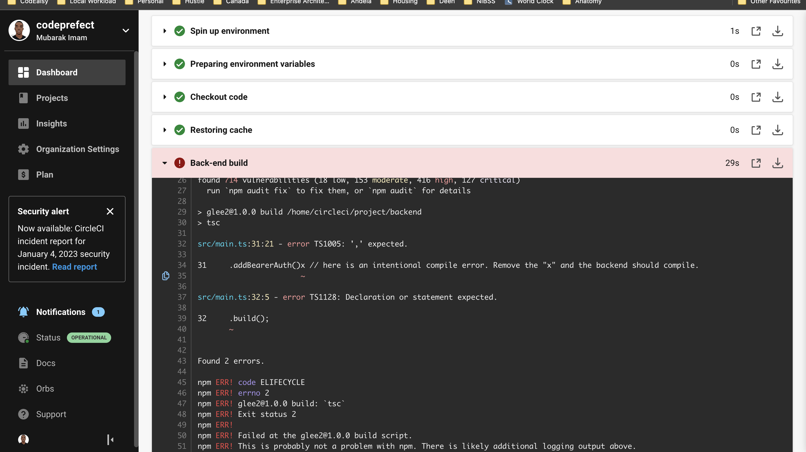

#### Figure 2 (Failed unit tests)

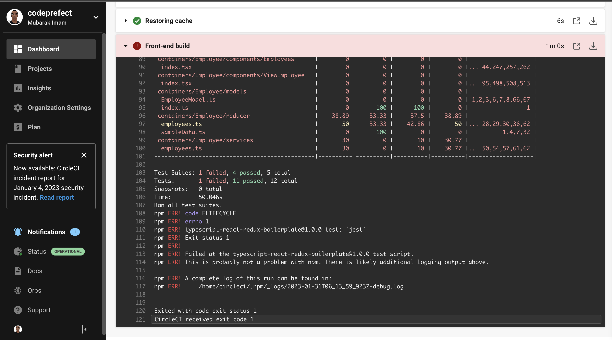

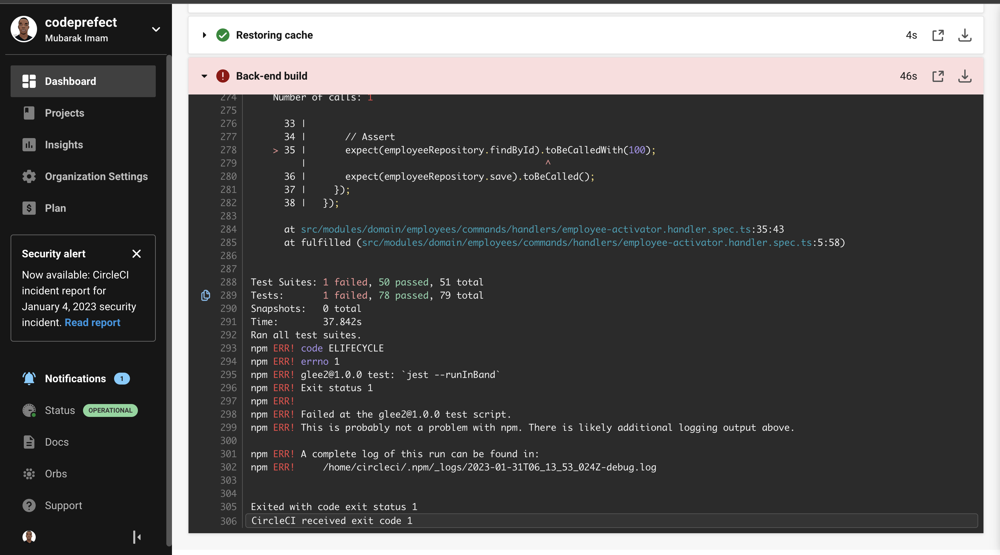

#### Figure 3 (Found vulnerabilities)


#### Figure 4 (Failed build alert)

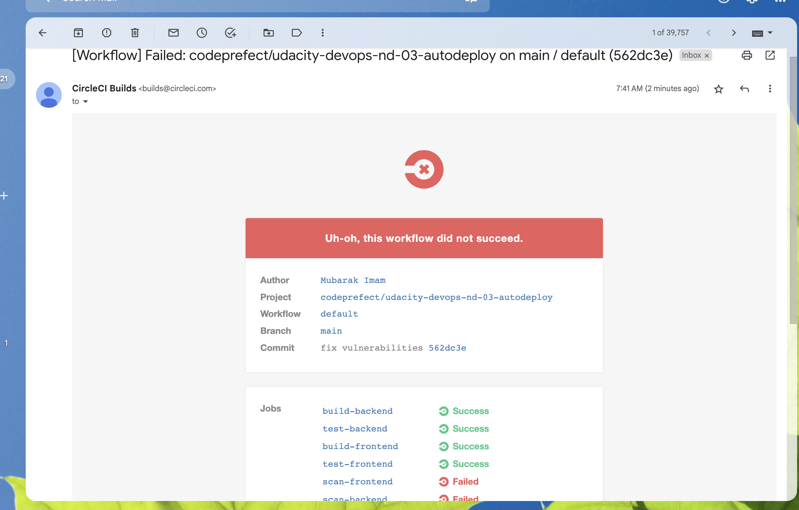

#### Figure 5 (Failed infra creation)

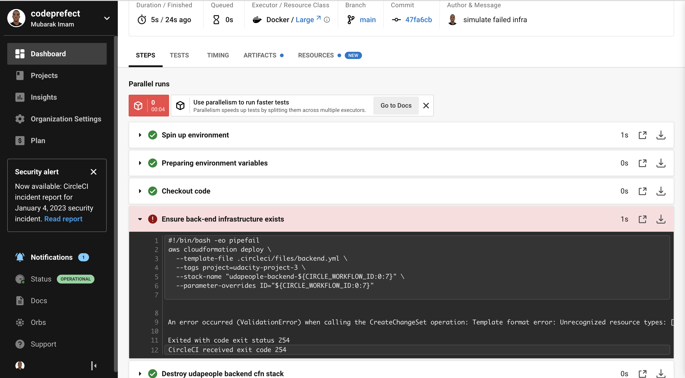

#### Figure 6 (Failed smoke test)

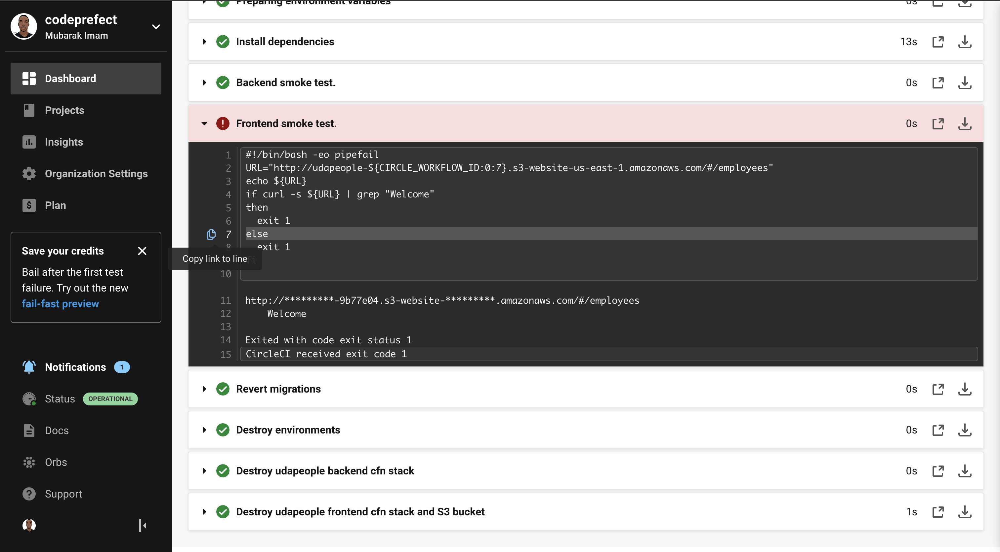

#### Figure 7 (Successful rollback after failed smoke test)

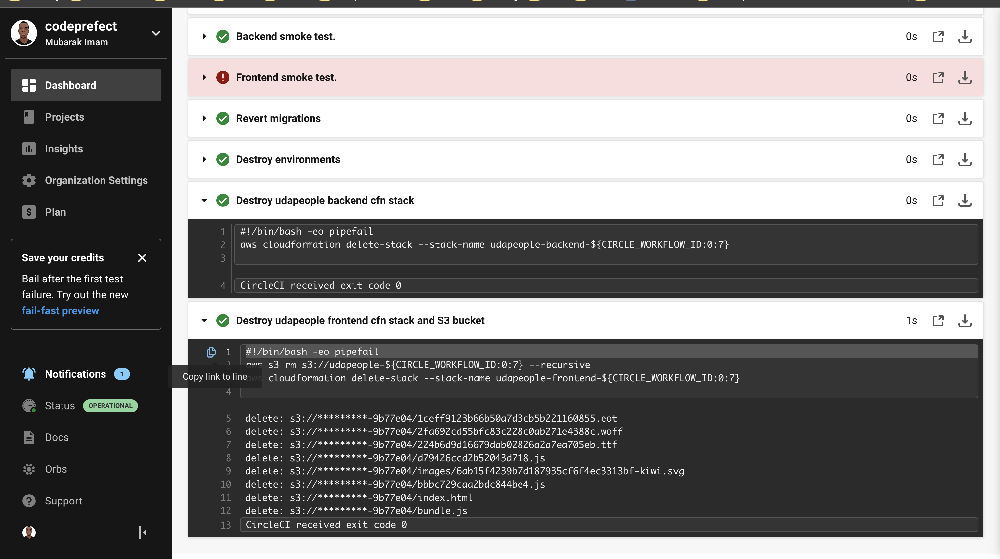

#### Figure 8 (Successful promotion to production)

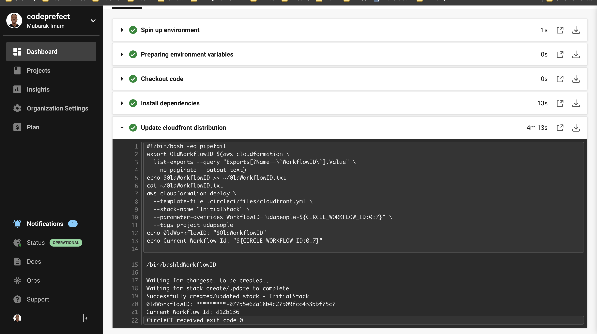

#### Figure 9 (Successful cleanup job)

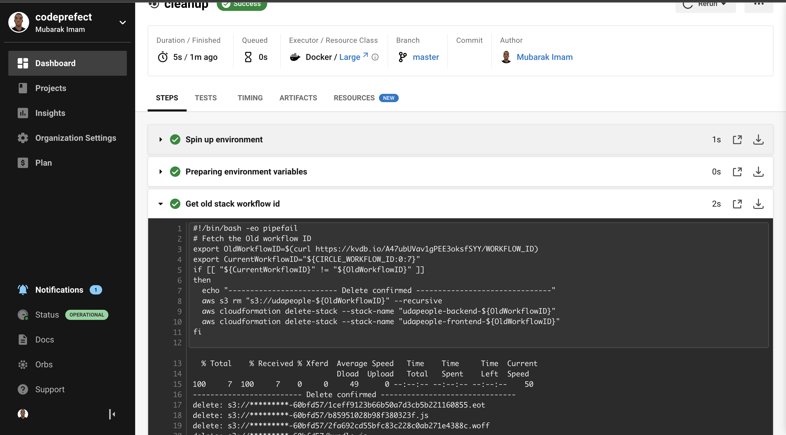

#### Figure 10 (Trigger evidence - master only)


#### Figure 11 (Prometheus - EC2 CPU and Disk Usage)


#### Figure 12 (Prometheus / AlertManager alert for EC2)

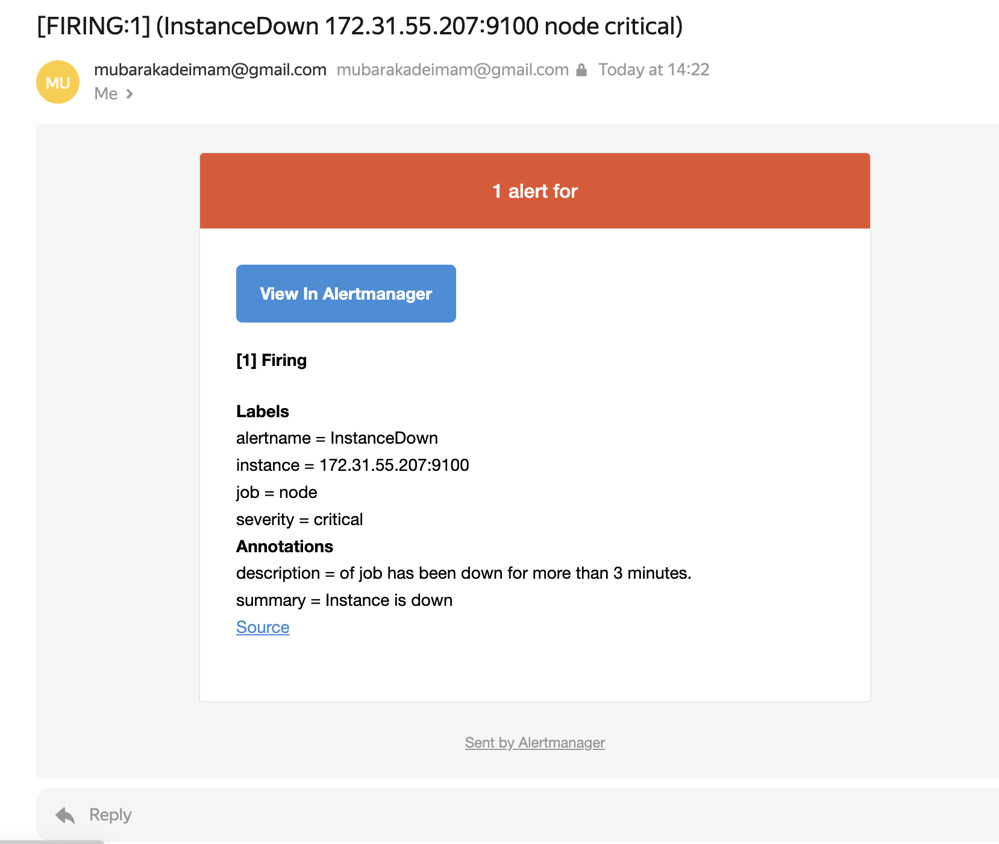

### Deployment Evidences

#### Figure 1 (URL03 Screenshot)

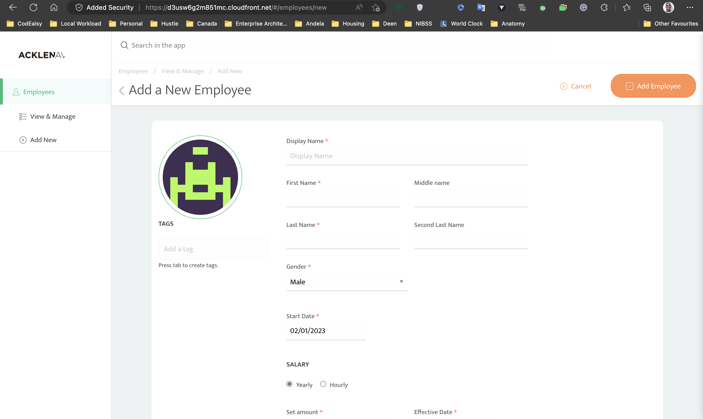

#### Figure 2 (URL04 Screenshot - Healthy backend)

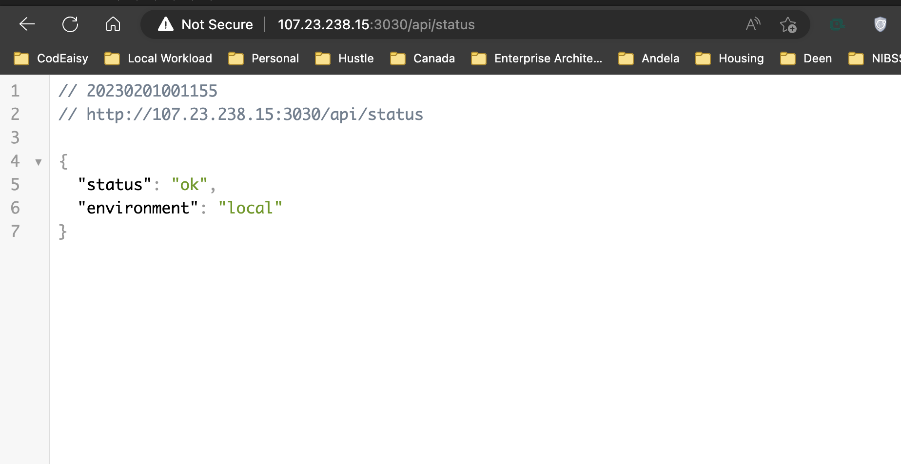

#### Figure 3 (URL05 Screenshot - Prometheus Server)

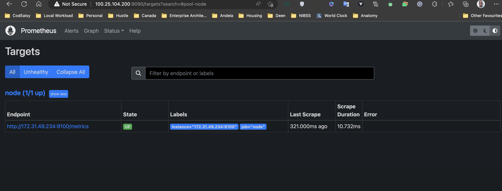

### How to reproduce

#### Create/Update required network infrastructure

```[bash]
./network/network-script-create.sh stack-name aws-region
# feel free to change the region to your own preferred region e.g
# ./network/network-script-create.sh udagram-network us-east-1
```

```[bash]
./network/network-script-update.sh stack-name aws-region, please use the same region used in create
# feel free to change the region to your own preferred region e.g
# ./network/network-script-update.sh udagram-network us-east-1
```

#### Create/Update application servers and other resources

```[bash]
./app-script-create.sh stack-name aws-region
# feel free to change the region to your own preferred region e.g
# ./app-script-create.sh udagram-clone us-east-1
```

```[bash]
./app-script-update.sh stack-name aws-region, please use the same region used in create
# feel free to change the region to your own preferred region e.g
# ./app-script-update.sh udagram-clone us-east-1
```

#### Optional - Create/Update jump servers

```[bash]
./jump-server/jump-script-create.sh stack-name aws-region
# feel free to change the region to your own preferred region e.g
# ./jump-server/jump-script-create.sh udagram-clone us-east-1
```

```[bash]
./jump-server/jump-script-update.sh stack-name aws-region, please use the same region used in create
# feel free to change the region to your own preferred region e.g
# ./jump-server/jump-script-update.sh udagram-clone us-east-1
```

Thank you.
