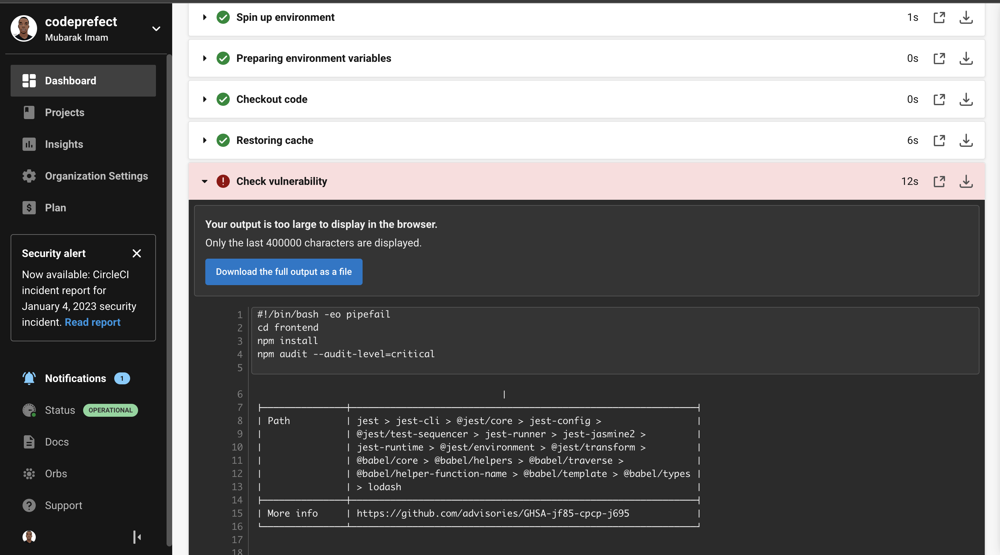
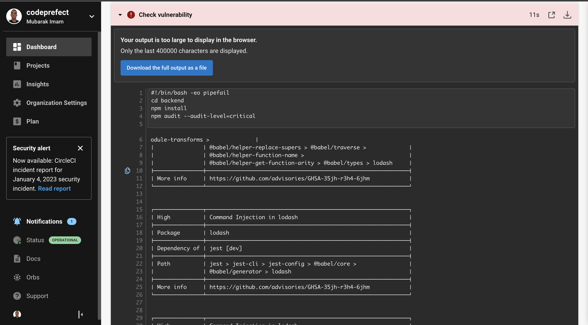
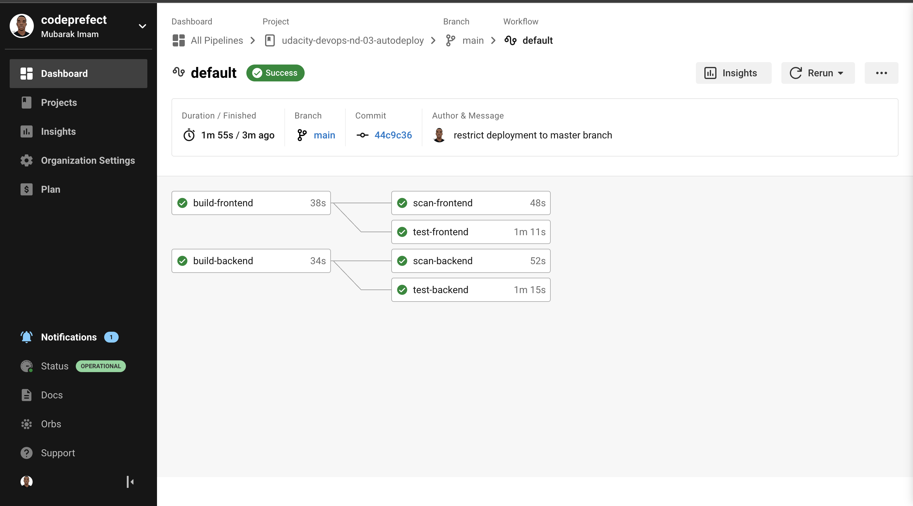
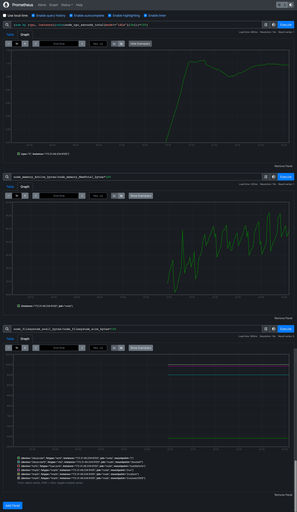

# Udacity Cloud DevOps Nanodegree

## Project 3: Give Your Application Auto-Deploy Superpowers

<object data="./docs/udapeople.pdf" type="application/pdf" width="700px" height="700px">
    <embed src="./docs/udapeople.pdf">
        
This browser does not support PDFs. Please download the PDF to view it: <a href="./docs/udapeople.pdf">Download PDF</a>.

    </embed>
</object>

### URLS

- URL01 - [Github](https://github.com/codeprefect/udacity-devops-nd-03-autodeploy.git)
- URL02 - [AWS S3](https://udapeople-cda858a.s3-website-us-east-1.amazonaws.com)
- URL03 - [CloudFormation](http://d3usw6g2m851mc.cloudfront.net/)
- URL04 - [Backend URL](http://ec2-54-175-186-169.compute-1.amazonaws.com/api/status)

### Pictures

Please find the details of my submission for project 3.

#### Figure 1 (Failed due to compile errors)

#### Figure 2 (Failed unit tests)

#### Figure 3 (Found vulnerabilities)

#### Figure 4 (Failed build alert)

#### Figure 5 (Failed infra creation)

#### Figure 6 (Failed smoke test)

#### Figure 7 (Successful rollback after failed smoke test)

#### Figure 8 (Successful promotion to production)

#### Figure 9 (Successful cleanup job)

#### Figure 10 (Trigger evidence - master only)

#### Figure 11 (Prometheus - EC2 CPU and Disk Usage)

#### Figure 12 (Prometheus / AlertManager alert for EC2)

### Deployment Evidences

#### Figure 1 (URL03 Screenshot)

#### Figure 2 (URL04 Screenshot - Healthy backend)

#### Figure 3 (URL05 Screenshot - Prometheus Server)

Thank you.
